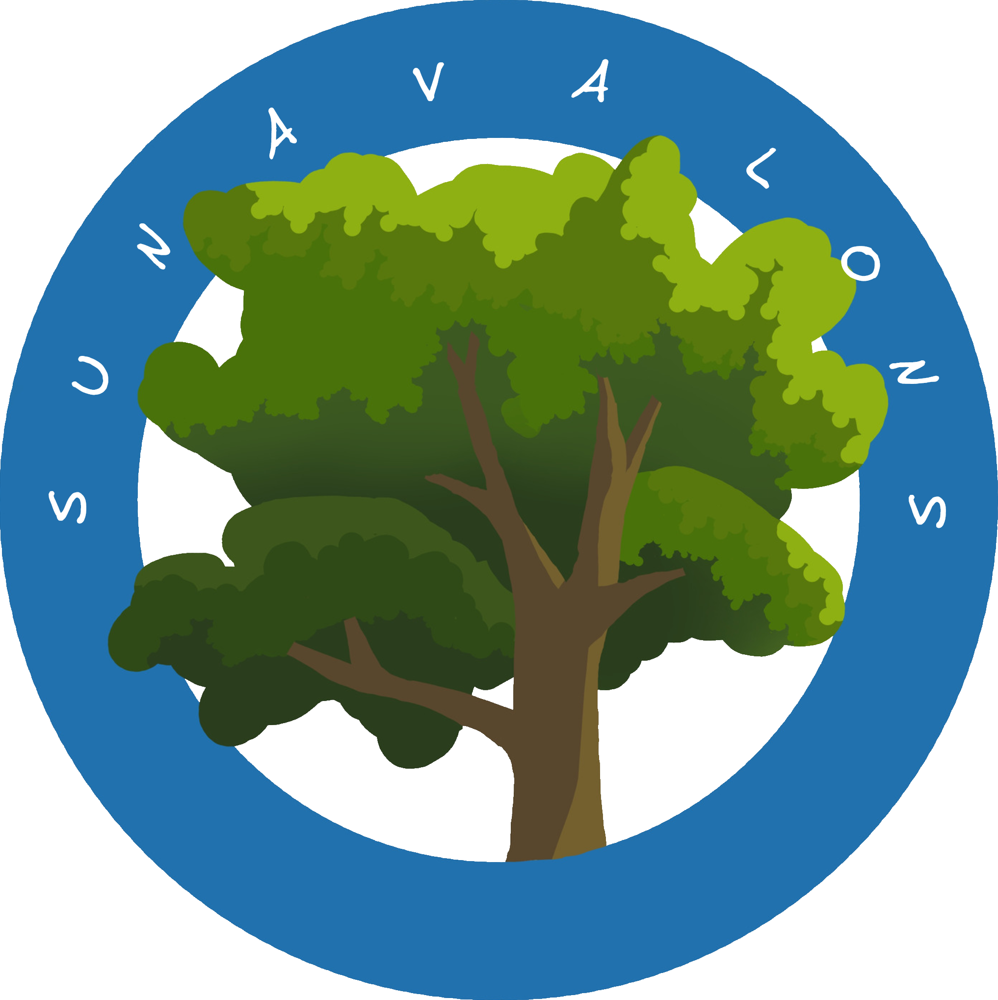

<div align="center">
    
    <h1>Sunavalons</h1>
</div>

# 📗 Table des matières
- [📗 Table des matières](#-table-des-matières)
- [À propos](#à-propos)
    - [Dépendances](#dépendances)
    - [API/Données](#apidonnées)
- [Pour commencer](#pour-commencer)
- [Feuille de Route](#feuille-de-route)
- [Auteurs](#auteurs)

# À propos
- Ce projet va pouvoir permettre d'analyser la cohérence entre les arbres plantés et les conditions environnementales locales. Pour pouvoir suggérer des espèces plus adaptées aux différents milieux urbains français.


<div align="center">
    <video width="600" controls>
        <source src="web/assets/demo.mp4" type="video/mp4">
    </video>
</div>

  ### Dépendances
  - Pour réaliser ce projet, nous avons principalement utilisé les bibliothèques suivantes :
    - <a href="https://flask.palletsprojects.com/">🌐 Flask</a>
    - <a href="https://numpy.org/">🔢 NumPy</a>
    - <a href="https://pandas.pydata.org/">📊 pandas</a>
    - <a href="https://scikit-learn.org/">🧠 scikit-learn</a>
    - <a href="https://plotly.com/python/">📈 Plotly</a>
    - <a href="https://scipy.org/">📐 SciPy</a>


  ### API/Données
  - Le datasets avec les noms des arbres a été pris sur <a href="https://www.data.gouv.fr/fr/)">data.gouv</a>
  - Les caractéristiques de ceux-ci ont été trouvées sur ce site [climescence](https://climessences.fr/fiches-especes/fiches-especes) puis normalisées par IA et vérifiées plusieurs fois entre différents modèles.

  - Nous avons utilisé plusieurs api pour chercher les caractéristiques des villes :

    - openstreetmap pour récupérer les coordonnées de la ville donnée par l’utilisateur.

    - open-meteo pour obtenir les précipitations, le rayonnement solaire moyen et  la température minimale dans un lieu donné.

    - isric pour obtenir le ph du sol à un endroit donné.


# Pour commencer
  - ## Compatibilité
    - Avant de commencer vérifiez que votre python soit compatible avec le projet :
      | Version  | Compatibilité |
      | --------------- | ----------- |
      | >= 3.9 | ✅ |
      | < 3.9, >3.8 | 🤷 |
      | <= 3.8  | ❌ |

    - Si vous lancez le projet sur votre machine, il est nécessaire de posséder un serveur Apache pour accéder à la page sur le net.

    <br>

    - [serveur sous windows](https://www.wampserver.com/)
    - Téléchargement Sous linux :
      ```bash
      sudo apt update
      sudo apt install apache2 php libapache2-mod-php php-cli php-mbstring php-xml php-curl
      ```


  - ## Démarrage Local
    - Pour lancer le projet, utilisez la commande
      ```bash
      ./start_project.sh
      ```

    - Allez ensuite à cette url : https://localhost:8080/

  - ## Lancement Rapide
    - Retrouvez notre site à cette adresse sinon :  <a href="https://strong-winning-mastodon.ngrok-free.app/">sunavalons</a>


# Feuille de Route
- [x] Récupérer tous les jeux de données nécessaires
- [x] Extraire ces données pour les ajouter au serveur
- [x] Développer les algorithmes pour faire les analyses sur les besoins des arbres
- [x] faire le site web pour exposer nos résultats

# Auteurs

| <a href="https://gitlab.univ-lr.fr/jdenis">  </a> | **Nom :** Louna Denis <br> **GitLab :** [mon profil](https://gitlab.univ-lr.fr/jdenis) |
|:----------------------------------------------------------------------------------------------------------------------------------:|:----------------------------------------------------------------------------------------------------:|

| <a href="https://gitlab.univ-lr.fr/rdunyach">  </a> | **Nom :** Raphael Dunyach <br> **GitLab :** [mon profil](https://gitlab.univ-lr.fr/rdunyach) |
|:----------------------------------------------------------------------------------------------------------------------------------:|:----------------------------------------------------------------------------------------------------:|

| <a href="https://gitlab.univ-lr.fr/nchamoua">  </a> | **Nom :** Noam Chamouard <br> **GitLab :** [mon profil](https://gitlab.univ-lr.fr/nchamoua) |
|:----------------------------------------------------------------------------------------------------------------------------------:|:----------------------------------------------------------------------------------------------------:|

| <a href="https://gitlab.univ-lr.fr/fsall">  </a> | **Nom :** Fatoumata Sall <br> **GitLab :** [mon profil](https://gitlab.univ-lr.fr/fsall) |
|:---------------------------------------------------------------------------------------------------------------------------------:|:----------------------------------------------------------------------------------------------------:|

| <a href="https://gitlab.univ-lr.fr/dollivie">  </a> | **Nom :** Dimitri Ollivier <br> **GitLab :** [mon profil](https://gitlab.univ-lr.fr/dollivie) |
|:----------------------------------------------------------------------------------------------------------------------------------:|:----------------------------------------------------------------------------------------------------:|

| <a href="https://gitlab.univ-lr.fr/gfournat">  </a> | **Nom :** Gwendhal Fournat <br> **GitLab :** [mon profil](https://gitlab.univ-lr.fr/gfournat) |
|:----------------------------------------------------------------------------------------------------------------------------------:|:----------------------------------------------------------------------------------------------------:|
